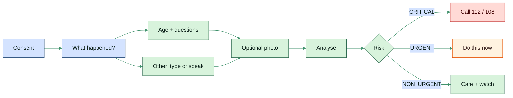
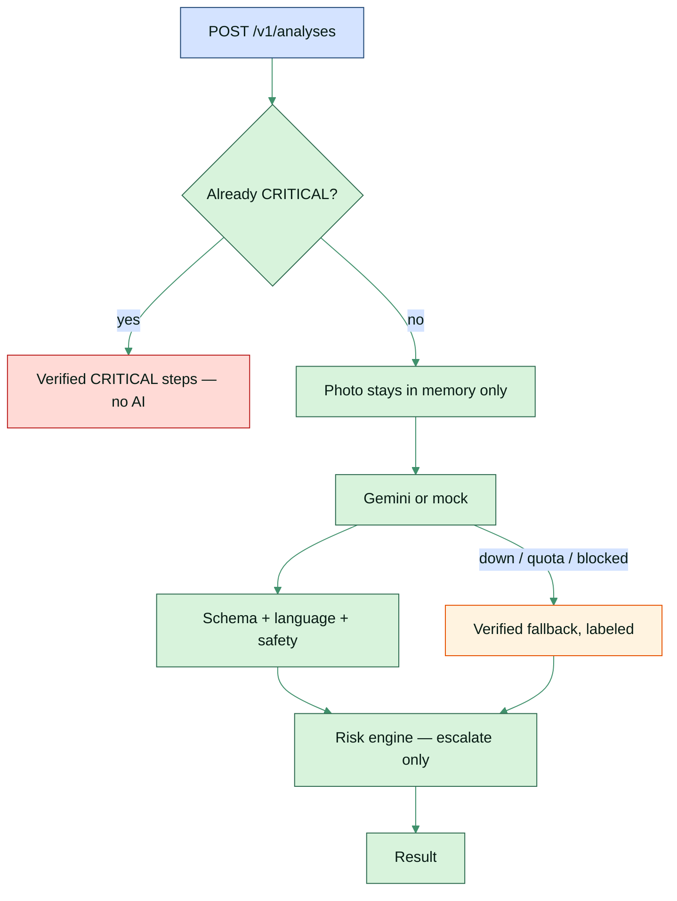

<div align="center">

# RESQ

### Someone is hurt. This walks you through what to do.


[The product](#the-product) · [How a session works](#how-a-session-works) · [Quick start](#quick-start) · [Docs](docs/README.md)

</div>

---

<table>
<tr>
<td bgcolor="#E8F5E9">

**This is first-aid help, not a doctor.**  
We walk you through what to do, one step at a time. If a life is in danger — unconscious, not breathing — **do not wait on this app. Call 112 or 108.**

</td>
</tr>
</table>

You are on a phone, maybe in a kitchen after hot oil, maybe on a road after a fall. You need **calm next steps**, not a chatbot that keeps asking, and not an account form.

**RESQ** is a bilingual first-aid assistant for India. You tap what happened — a burn, a snake bite, chest pain — or you type / speak it in your own words (English, Hindi, or Hinglish). You answer a few large buttons. Then you get numbered steps you can actually do.

If the answers say this is life-threatening, the first thing on screen is **Call 112** and **Call 108**. The AI is never in the way of that. If the AI is tired, out of quota, or says something unsafe, you still get **verified first-aid** from content we wrote ahead of time. That fallback is labeled honestly.

Steps are grounded in **WHO, NHS First Aid, the Indian Red Cross, and India’s Ministry of Health** — not random internet advice.

<table>
<tr>
<td width="33%" bgcolor="#E8F5E9" valign="top">

**Who it is for**  
Anyone in India who needs clear first-aid *right now* — in English or हिंदी.

</td>
<td width="33%" bgcolor="#E3F2FD" valign="top">

**Who this repo is for**  
You, if you want to run it, read the design, or add a new emergency.

</td>
<td width="34%" bgcolor="#FFF3E0" valign="top">

**What you need to run it**  
Python 3.9+ and Node 20+. No Docker. No cloud account.

</td>
</tr>
</table>

---

## The product

What the app is built to do — the same promises as the product design:

<table>
<tr>
<td width="50%" bgcolor="#E8F5E9" valign="top">

**Guided, not chatty**  
Pick a card. Answer big options. Get a result. Answers stay on the phone until the last tap — **one request**, not one API call per question. That matters on a shaky mobile network.

**English and Hindi for real**  
The whole experience is `/en/...` or `/hi/...`. Buttons, questions, errors, and fallbacks each live in their own language files. A missing Hindi line **fails the build** instead of showing English to a Hindi user.

**Age changes the help**  
First-aid is different for a baby, a child, an adult, and someone over 60 — CPR, choking, doses. The app asks *how old*, not “who is it?”. Pregnancy skips that question.

</td>
<td width="50%" bgcolor="#E3F2FD" valign="top">

**AI is a helper, not the system**  
Gemini can draft steps. Between the model and you sit schema checks, a language check, a banned-phrase filter, and a risk engine. Hard rules can only **raise** risk (to URGENT or CRITICAL). They never talk a critical case down.

**Works when AI does not**  
Quota gone, model down, or unsafe output → verified YAML first-aid, clearly labeled. You are never left with a blank screen.

**Privacy by default**  
No accounts, no name, no phone. No photo is ever saved — it is checked in memory and thrown away. Sessions and answers expire in **24 hours**.

</td>
</tr>
</table>

---

## How a session works



1. **Consent** — “This is first-aid help, not a doctor.” Then a session token. No signup.
2. **Landing** — “What happened?” Search in English or Hindi (`burn`, `jalna`, `सांप`…) or tap a card. **Other problem** if nothing fits.
3. **Questions** — age band, then a few yes/no-style questions. Pregnancy goes straight to “what is happening?”
4. **Photo** — optional. Skip in one tap. Analysed, never written to disk.
5. **Result** — CRITICAL (call buttons first), URGENT (do this now), or NON_URGENT (care and watch).

<table>
<tr>
<th bgcolor="#2D6A4F"><font color="#FFFFFF">Try this locally</font></th>
<th bgcolor="#2D6A4F"><font color="#FFFFFF">Path</font></th>
</tr>
<tr>
<td bgcolor="#E8F5E9">Guided assessment</td>
<td bgcolor="#E8F5E9">Landing → <b>Burn</b> → answer the questions</td>
</tr>
<tr>
<td bgcolor="#F1F8F4">Free text + voice</td>
<td bgcolor="#F1F8F4">Landing → <b>Other problem</b> → type or dictate</td>
</tr>
<tr>
<td bgcolor="#E8F5E9">Hindi</td>
<td bgcolor="#E8F5E9">Header toggle <b>हिंदी</b>, or open <code>/hi</code></td>
</tr>
<tr>
<td bgcolor="#FFDAD6">Instant CRITICAL, no AI</td>
<td bgcolor="#FFDAD6">Burn → option that they are struggling to breathe</td>
</tr>
<tr>
<td bgcolor="#E8F5E9">Photo</td>
<td bgcolor="#E8F5E9">Last step of any assessment</td>
</tr>
</table>

---

## Emergencies covered

Twenty-two cards, plus **Other problem** when the grid is not enough.

<table>
<tr>
<th bgcolor="#1B4372"><font color="#FFFFFF">Injury</font></th>
<th bgcolor="#BA1A1A"><font color="#FFFFFF">Medical</font></th>
<th bgcolor="#2D6A4F"><font color="#FFFFFF">Bites &amp; environment</font></th>
</tr>
<tr>
<td bgcolor="#E3F2FD">Burn</td>
<td bgcolor="#FFEBEE">Chest pain</td>
<td bgcolor="#E8F5E9">Snake bite</td>
</tr>
<tr>
<td bgcolor="#E8EEF7">Cut or bleeding</td>
<td bgcolor="#FFF5F5">Breathing difficulty</td>
<td bgcolor="#F1F8F4">Dog or animal bite</td>
</tr>
<tr>
<td bgcolor="#E3F2FD">Broken bone or sprain</td>
<td bgcolor="#FFEBEE">Head injury</td>
<td bgcolor="#E8F5E9">Electric shock</td>
</tr>
<tr>
<td bgcolor="#E8EEF7">Choking</td>
<td bgcolor="#FFF5F5">Stroke</td>
<td bgcolor="#F1F8F4">Heatstroke</td>
</tr>
<tr>
<td bgcolor="#E3F2FD">Eye injury</td>
<td bgcolor="#FFEBEE">Seizure</td>
<td bgcolor="#E8F5E9">Drowning</td>
</tr>
<tr>
<td bgcolor="#E8EEF7"></td>
<td bgcolor="#FFF5F5">High fever</td>
<td bgcolor="#F1F8F4">Dehydration</td>
</tr>
<tr>
<td bgcolor="#E3F2FD"></td>
<td bgcolor="#FFEBEE">Diabetic emergency</td>
<td bgcolor="#E8F5E9">Allergic reaction</td>
</tr>
<tr>
<td bgcolor="#E8EEF7"></td>
<td bgcolor="#FFF5F5">Pregnancy emergency</td>
<td bgcolor="#F1F8F4">Poisoning</td>
</tr>
<tr>
<td bgcolor="#E3F2FD"></td>
<td bgcolor="#FFEBEE">Fainting or unconscious</td>
<td bgcolor="#E8F5E9"></td>
</tr>
</table>

Add another emergency by writing YAML — no Python change:

`backend/app/content/{en,hi}/questions/` and `fallback/`.

---

## What happens after they tap “Get first-aid steps”



That pipeline *is* the product: the model never talks straight to the user.  
Details: [architecture](docs/01-architecture.md) · [prompts and risk](docs/05-ai-and-prompts.md) · [privacy](docs/06-security-privacy.md).

---

## Quick start

<table>
<tr>
<td bgcolor="#E8F5E9">

Need **Python 3.9+** and **Node.js 20+**. Nothing else.

</td>
</tr>
</table>

```bash
make setup      # venv, npm install, .env files, SQLite migrations
```

Two terminals:

```bash
make backend    # http://localhost:8000   API docs → /docs
make frontend   # http://localhost:3000
```

Open [http://localhost:3000](http://localhost:3000) — you land on `/en`. The header toggle switches to `/hi`.

<details>
<summary>Same setup without Make</summary>

```bash
# Terminal 1 — API
cd backend
python3 -m venv .venv
.venv/bin/pip install -r requirements-dev.txt
cp .env.example .env
.venv/bin/alembic upgrade head
.venv/bin/uvicorn app.main:app --reload --port 8000

# Terminal 2 — UI
cd frontend
npm install
cp .env.example .env.local
npm run dev
```

</details>

Locally the database is one SQLite file. Production is Postgres. The same migrations run on both — [local vs production](docs/10-local-development.md).

---

## Using Gemini (optional)

Development uses a **mock** so you never burn the free Gemini quota while clicking around.

```bash
# backend/.env
AI_PROVIDER=gemini
GEMINI_API_KEY=your-key
GEMINI_MODEL=gemini-3.5-flash
```

`DAILY_AI_BUDGET` caps real calls. Any failure still falls back to verified content.

<details>
<summary>Force each failure path in the mock (type these in “Other problem”)</summary>

| Trigger | What you will see |
| --- | --- |
| `__mock_fail__` | AI unavailable → verified fallback |
| `__mock_quota__` | Daily quota exhausted → fallback for the rest of the day |
| `__mock_unsafe__` | Harmful remedy blocked → fallback |
| `__mock_wrong_language__` | Wrong-language answer blocked → fallback |
| `__mock_bad_source__` | Invented citation stripped |

The result screen says which of these happened.

</details>

---

## Tests

```bash
make test     # backend pytest + frontend message parity
make lint     # ruff + TypeScript + ESLint
make smoke    # real browser, both languages (servers must already be running)
```

| Suite | What it proves |
| --- | --- |
| `backend/tests/unit` | Risk engine, safety filter, images, EN/HI content parity |
| `backend/tests/integration` | Every endpoint, session ownership, rate limits |
| `backend/tests/ai_cases` | Triage in both languages, injection, every degradation path |
| `frontend/tests` | English and Hindi UI strings stay in sync |
| `e2e/smoke.mjs` | Consent → assessment → result in EN and HI; fails on console errors or English leaking onto a Hindi screen |

First `make smoke` downloads Chromium into `e2e/browsers/` (gitignored, a few hundred MB).

---

## Repo map

```
resq/
├── frontend/          Next.js 16 · React 19 · next-intl · Tailwind
│   └── messages/      UI strings — en.json + hi.json
├── backend/           FastAPI · SQLAlchemy · Alembic
│   └── app/content/   Categories, questions, fallbacks, safety lists
├── e2e/               Playwright smoke walkthrough
├── docs/              Architecture and design (start at docs/README.md)
└── Makefile           setup · backend · frontend · test · lint · smoke
```

| What | Single source of truth |
| --- | --- |
| UI strings | `frontend/messages/{en,hi}.json` |
| Categories, questions, fallback guidance | `backend/app/content/{en,hi}/` |
| Unsafe-phrase lists | `backend/app/content/safety/{en,hi}.yaml` |

A half-finished Hindi file fails startup and CI rather than showing English to a Hindi user.

---

## Stack

| Layer | Choice | Why |
| --- | --- | --- |
| UI | Next.js, locale-prefixed routes | `/en` and `/hi` are real URLs, not a query flag |
| API | FastAPI | Typed pipeline, OpenAPI at `/docs` |
| Data (local) | SQLite | Clone and run — no Docker |
| Data (prod) | Postgres | Same models and migrations |
| AI | Gemini, or mock | Mock in dev/CI; live key optional |
| Content | YAML per language | Change first-aid text without shipping Python |

Built to stay on **free tiers** (Vercel + Render + Neon + Gemini). The server may sleep; the UI says it is waking up.

---

## Read next

| Start here | Then |
| --- | --- |
| [docs/README.md](docs/README.md) — reading order | [Overview](docs/00-overview.md) · [Architecture](docs/01-architecture.md) |
| [Language design](docs/02-i18n.md) | [API](docs/04-api.md) · [AI, prompts, risk](docs/05-ai-and-prompts.md) |
| [Privacy](docs/06-security-privacy.md) | [User flows](docs/09-user-flows.md) · [Local vs prod](docs/10-local-development.md) |

---

<div align="center">

<table>
<tr>
<td bgcolor="#FFDAD6" align="center">

RESQ gives first-aid steps. It does not diagnose, prescribe, or replace calling **112** or **108**.

</td>
</tr>
</table>

</div>
